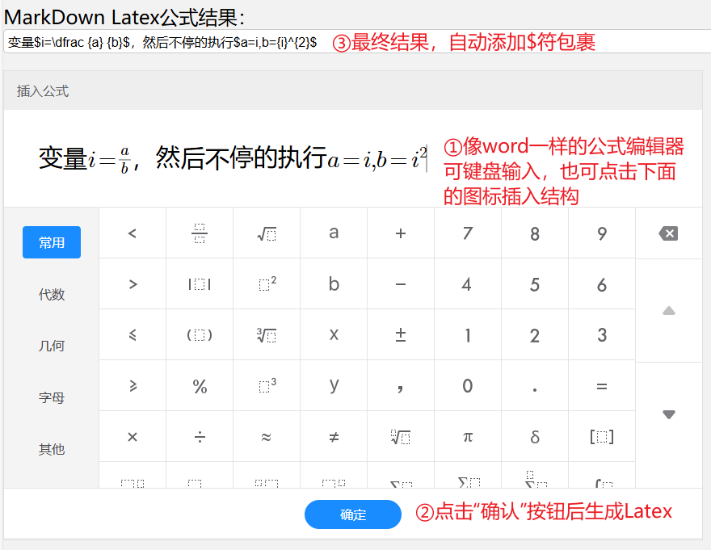

# MarkDown内嵌Latex公式编辑器

本工具是针对中文MarkDown写作的Latex公式编辑器，纯前端项目。

内置的公式编辑器来自[Formula-Editor](https://github.com/SugarTurboS/Formula-Editor)项目，本项目对其进行封装和修改，使得其适应中文MarkDown写作的需要，并且完全离线。

## 使用说明

用`git`克隆本仓库，或者直接下载本仓库的zip，打开`http静态服务器.exe`即可进入网页。

编辑器分为两部分，一部分是公式编辑区，另一部分是结果显示区。

结果显示区的修改会实时同步到公式编辑区，公式编辑区的修改需要点击`确认`按钮后才会同步到结果显示区。

用户可直接在公式编辑区里面用键盘混合输入中文与英文公式，点击软键盘插入分式等数学符号，最终结果会自动添加`$`符包裹公式。

但是需要注意，中文句子请用中文标点，数学公式内部请用英文标点，如果乱用标点会导致`$`符的自动添加不符合预期。

网页界面如下图所示：

## 开发说明

本项目`out`文件夹内即为网页的全部内容，其中`out\index.html`为本项目的实际代码。

`out\edit`文件夹里面的内容为[Formula-Editor](https://github.com/SugarTurboS/Formula-Editor)项目的编译产物。本项目对其编译产物直接进行了修改，修改内容如下：

1. 屏蔽了`取消按钮`和`关闭按钮`，通过`style="display:none;"`实现。
2. 将项目用到的图片从cdn下载到本地，并修改了相关`.css`和`.js`内部的链接。
3. 注释了所有非显示异常的`console.log`，避免产生大量调试输出。

## 协议

和[Formula-Editor](https://github.com/SugarTurboS/Formula-Editor)项目一致，采用MIT协议开源
